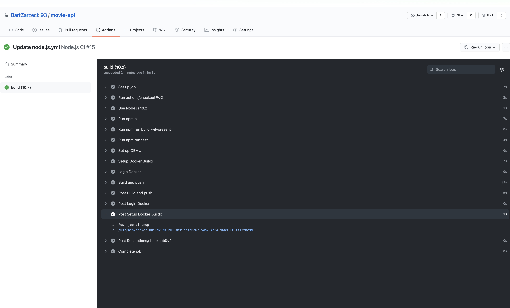
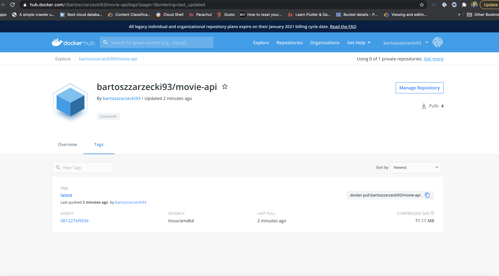

# Movie-api

> Backend API for IMdb movies

Thanks to this app you can:

1. `POST /movies`
   1. Create a movie object based on movie title passed in the request body
   2. Bade on title additional movie details that is fetched from
      https://omdbapi.com/ and saved to the mongo database.
   3. Only authorized users can create a movie.
   4. `Basic` users are restricted to create a 5 movies per month (calendar
      month). `Premium` users have no limits.
2. `GET /movies`
   1. Get a list of all movies created by an authorized user.
3. `POST /auth/login`
   1. Login to the app with username and password and get authorization token.
4. `POST /auth/register`
   1. Register to the app with username, password, name and role.
   2. Possible options for role : basic or premium

⚠️ Don't forget to verify user's authorization token before processing the
request. The token should be passed in request's `Authorization` header.

```
Authorization: Bearer <token>
```

## Usage

Rename "config/config.env.env" to "config/config.env" and update the values/settings to your own or you can use:

```
MONGO_URI = (will be send in an email)

PORT = 3000

NODE_ENV = development

JWT_SECRET=secret

JWT_EXPIRE=30m

JWT_ISSUER=https://www.netguru.com/

IMDB_KEY = 262b69da
```

## Install Dependencies

```
npm install
```

## Testing with jest

```
npm run test
```

## Run App

```
# Run in dev mode
npm run dev

# Run in prod mode
npm start
```

## Run locally with docker

1. Clone this repository
2. Go to docker-compose.yml and paste the link that you got in the email under MONGO_URI
3. Run from root dir

```
docker-compose up -d
```

By default the auth service will start on port `3000`

To test or use api please go to:

```
http://localhost:3000/api-docs/

```

Register as a new user or use the username and password from example.json file to login.
If you register/login correctly, copy generated token and paste into the authorization window (Bearer + "token") that will pop out after clicking on Authorize button in the top right corner. After pasting the full authorization token in the pop window, click authorize.

After that process you will be able to create and get movies. (Following the rules that are described at the top of the Readme page)

To stop the service run

```
docker-compose down
```

## Documentation

You can access full documentation(SWAGER) with

```
http://localhost:3000/api-docs/

```

## Github Actions

Success with Github Actions!


Success with docker!

